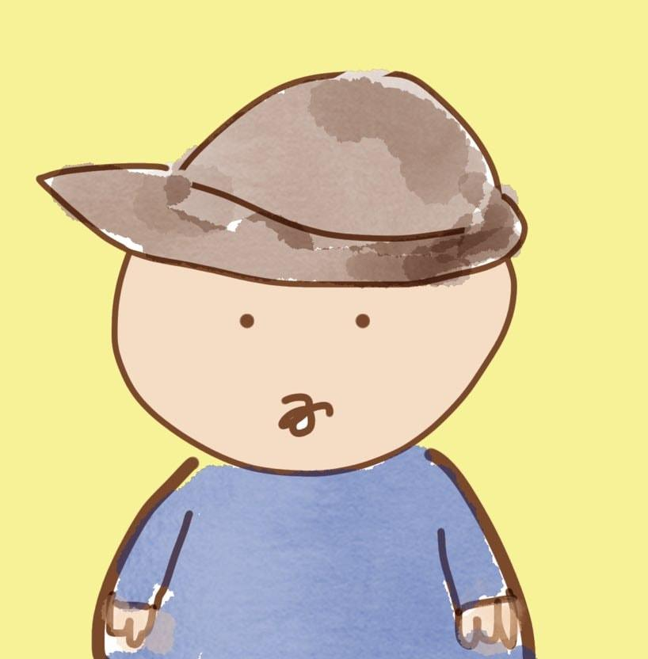

<picture>
 <source media="(prefers-color-scheme: dark)" srcset="profile.jpg">
 <source media="(prefers-color-scheme: light)" srcset="profile.jpg">
 
</picture>

# Chung Yuen LEUNG
## Origin from Hong Kong, now exploring new opportunities in United Kingdom
### Part-time Software Solution Provider
### Owner of E-Commerce company
### Chef
## Tech Skill
1. Java Programming
2. SQL and Database Knowledge
3. Python
4. Object-Oriented Programming
5. Unity (Game Developement)
## Soft Skill
1. Accounting (Basic)
2. Retail Management
3. Organisational Skill
4. Communications Skill
5. Problem Analysis and Solving
6. Story-telling
## Language
1. English
2. Chinese

<!--
**raymondlcy/raymondlcy** is a ✨ _special_ ✨ repository because its `README.md` (this file) appears on your GitHub profile.

Here are some ideas to get you started:

- 🔭 I’m currently working on ...
- 🌱 I’m currently learning ...
- 👯 I’m looking to collaborate on ...
- 🤔 I’m looking for help with ...
- 💬 Ask me about ...
- 📫 How to reach me: ...
- 😄 Pronouns: ...
- ⚡ Fun fact: ...
-->
